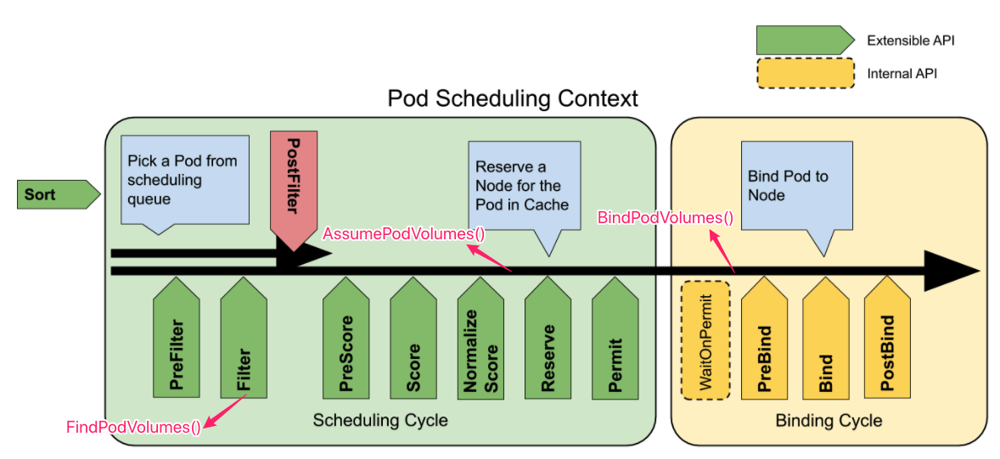

# Volume 相关操作在调度过程中的执行时机 #



这是 Kubenetes 调度框架图，每个阶段都有可以插入自定义的逻辑进而控制整个调度的流程。

其中涉及到四个与 Volume 相关的操作，其中 `DeletePodBindings()` 是调度失败后执行的，没有在图中标示出来。

接下来会针对这四个操作的执行时机详细分析。

## FindPodVolumes() ##

`FindPodVolumes()` 是在 **预选** 阶段执行的，这一阶段主要筛选出哪些节点可以运行当前的 Pod。而这里的 `FindPodVolumes()` 会作为其中的一个筛选条件。它会检测当前 Pod 上所有的 PVC 对象能否在当前节点上运行，即 PVC 和对应的 PV 能否运行在当前节点上。

在预选阶段执行的插件需要实现下面这个 interface 以及内部的 `Filter()` 函数。

``` go
type FilterPlugin interface {
	Plugin
	Filter(ctx context.Context, state *CycleState, pod *v1.Pod, nodeInfo *schedulernodeinfo.NodeInfo) *Status
}
```

`FindPodVolumes()` 对应的 Filter 名称为 "VolumeBinding"，代码位于 `pkg/scheduler/framework/plugins/volumebinding`。

``` go
type VolumeBinding struct {
	binder scheduling.SchedulerVolumeBinder
}

...
const Name = "VolumeBinding"

...

func (pl *VolumeBinding) Filter(ctx context.Context, cs *framework.CycleState, pod *v1.Pod, nodeInfo *schedulernodeinfo.NodeInfo) *framework.Status {
    ...
	if !podHasPVCs(pod) {
		return nil
	}

	reasons, err := pl.binder.FindPodVolumes(pod, node)
    ...
}

// New initializes a new plugin with volume binder and returns it.
func New(_ *runtime.Unknown, fh framework.FrameworkHandle) (framework.Plugin, error) {
	return &VolumeBinding{
		binder: fh.VolumeBinder(),
	}, nil
}
```

可以看出 VolumeBinding Filter 实现了 `Filter()` 函数。`Filter()` 执行时首先会检测当前 Pod 是否关联有 PVC 对象，如果没有的话则不需要处理，否则的话就会调用 `FindPodVolumes()` 进行验证。

VolumeBinding Filter 会在创建 Scheduler 对象的时候进行注册。

``` go
func NewInTreeRegistry() framework.Registry {
	return framework.Registry{
        ...
		volumebinding.Name:                         volumebinding.New,
        ...
	}
}
```

然后在预选节点会执行其中的 `Filter()` 函数。相关的函数调用栈如下：

``` go
scheduleOne()
  sched.Algorithm.Schedule()
    g.findNodesThatFitPod()
      findNodesThatPassFilters()
        g.podPassesFiltersOnNode()
          prof.RunFilterPlugins()
            RunFilterPlugins()
              runFilterPlugin()
                Filter()
```

其中更加详细的分析请参见 Kube-Scheduler 的相关章节。

## AssumePodVolumes() ##

`AssumePodVolumes()` 在优选阶段结束后执行，它会将 PVC 和 PV 进行预绑定，即在缓存中保存其绑定关系。

它会直接在 `scheduleOne()` 中被调用，`scheduleOne()` 是整个调度框架的核心实现。

``` go
func (sched *Scheduler) scheduleOne(ctx context.Context) {
    ...
	scheduleResult, err := sched.Algorithm.Schedule(schedulingCycleCtx, prof, state, pod)
    ...
	allBound, err := sched.VolumeBinder.AssumePodVolumes(assumedPod, scheduleResult.SuggestedHost)
	if err != nil {
		sched.recordSchedulingFailure(prof, assumedPodInfo, err, SchedulerError,
			fmt.Sprintf("AssumePodVolumes failed: %v", err))
		metrics.PodScheduleErrors.Inc()
		return
	}

	// Run "reserve" plugins.
	if sts := prof.RunReservePlugins(schedulingCycleCtx, state, assumedPod, scheduleResult.SuggestedHost); !sts.IsSuccess() {
        ...
	}
    ...
}
```

在 `scheduleOne()` 中的 `sched.Algorithm.Schedule()` 调用会执行预选和优选等操作，然后就会执行这里的 `AssumePodVolumes()`，接着会运行 ReservePlugins，也就是图中的 "Reserve" 阶段。

另外，从上面的代码中也可以知道，如果 `AssumePodVolumes()` 执行失败，即 PVC 和 PV 不能执行预绑定操作，则整个调度流程就会结束，也就意味着 Pod 不能调度到当前节点。

## BindPodVolumes() ##

`BindPodVolumes()` 会执行 PVC 和 PV 的绑定操作，它会在执行完调度之后，并且在执行 Pod 的绑定操作之前执行。

``` go
func (sched *Scheduler) scheduleOne(ctx context.Context) {
    ...
	// Run "permit" plugins.
	runPermitStatus := prof.RunPermitPlugins(schedulingCycleCtx, state, assumedPod, scheduleResult.SuggestedHost)
    ...

	// bind the pod to its host asynchronously (we can do this b/c of the assumption step above).
	go func() {
		bindingCycleCtx, cancel := context.WithCancel(ctx)
		defer cancel()
		metrics.SchedulerGoroutines.WithLabelValues("binding").Inc()
		defer metrics.SchedulerGoroutines.WithLabelValues("binding").Dec()

		waitOnPermitStatus := prof.WaitOnPermit(bindingCycleCtx, assumedPod)
        ...

		// Bind volumes first before Pod
		if !allBound {
			err := sched.bindVolumes(assumedPod)
            ...
		}

		// Run "prebind" plugins.
		preBindStatus := prof.RunPreBindPlugins(bindingCycleCtx, state, assumedPod, scheduleResult.SuggestedHost)
        ...

		err := sched.bind(bindingCycleCtx, prof, assumedPod, scheduleResult.SuggestedHost, state)
        ...
}
```

从代码中可以看出，`RunPermitPlugins()` 执行图中 "Permit" 阶段的工作，完成后整个调度工作(图中的 Scheduling Cycle)已经结束，接着开始绑定操作(图中的 Binding Cycle)。在绑定阶段，在 `WaitOnPermit()` 执行完后，便开始执行 Volume 的绑定工作，Volume 绑定成功的情况下，接着再执行 Pod 与当前节点的预绑定和绑定工作，对应的函数分别为 `RunPreBindPlugins()` 和 `bind()`。

这里 Volume 绑定工作的函数为 `bindVolumes()`。

``` go
func (sched *Scheduler) bindVolumes(assumed *v1.Pod) error {
	klog.V(5).Infof("Trying to bind volumes for pod \"%v/%v\"", assumed.Namespace, assumed.Name)
	err := sched.VolumeBinder.BindPodVolumes(assumed)
	if err != nil {
        ...
	}

	klog.V(5).Infof("Success binding volumes for pod \"%v/%v\"", assumed.Namespace, assumed.Name)
	return nil
}
```

这个函数主要逻辑就是调用本节中的 `BindPodVolumes()` 来执行 PVC 和 PV 的绑定工作。

## DeletePodBindings() ##

这个函数主要在 Pod 调度失败的情况下执行的，它会将预绑定的操作进行回滚，即从缓存中删除绑定关系。

``` go
// New returns a Scheduler
func New(client clientset.Interface,
	informerFactory informers.SharedInformerFactory,
	podInformer coreinformers.PodInformer,
	recorderFactory profile.RecorderFactory,
	stopCh <-chan struct{},
	opts ...Option) (*Scheduler, error) {

    ...
	addAllEventHandlers(sched, informerFactory, podInformer)
	return sched, nil
}
```

首先在 Kube-Scheduler 创建调度器的时候，会通过 `addAllEventHandlers()` 注册一些回调函数。

``` go
func addAllEventHandlers(
	sched *Scheduler,
	informerFactory informers.SharedInformerFactory,
	podInformer coreinformers.PodInformer,
) {
    ...
	// unscheduled pod queue
	podInformer.Informer().AddEventHandler(
		cache.FilteringResourceEventHandler{
			FilterFunc: func(obj interface{}) bool {
                ...
			},
			Handler: cache.ResourceEventHandlerFuncs{
				AddFunc:    sched.addPodToSchedulingQueue,
				UpdateFunc: sched.updatePodInSchedulingQueue,
				DeleteFunc: sched.deletePodFromSchedulingQueue,
			},
		},
	)
    ...
}
```

其中，在 Pod 调度失败的时候会执行的函数为 `deletePodFromSchedulingQueue()`。

``` go
func (sched *Scheduler) deletePodFromSchedulingQueue(obj interface{}) {
    ...
	klog.V(3).Infof("delete event for unscheduled pod %s/%s", pod.Namespace, pod.Name)
	if err := sched.SchedulingQueue.Delete(pod); err != nil {
		utilruntime.HandleError(fmt.Errorf("unable to dequeue %T: %v", obj, err))
	}
	if sched.VolumeBinder != nil {
		// Volume binder only wants to keep unassigned pods
		sched.VolumeBinder.DeletePodBindings(pod)
	}
    ...
}
```

首先，会将 Pod 从调度队列中删除，接着就会调用本节提到的 `DeletePodBindings()` 从缓存中 PVC 和 PV 的绑定关系。

## 总结 ##

本节通过从代码层面详细分析了在 Pod 调度阶段所有与 Volume 绑定相关操作的执行时机。下面的部分会逐一分析这些函数内部的实现逻辑。
